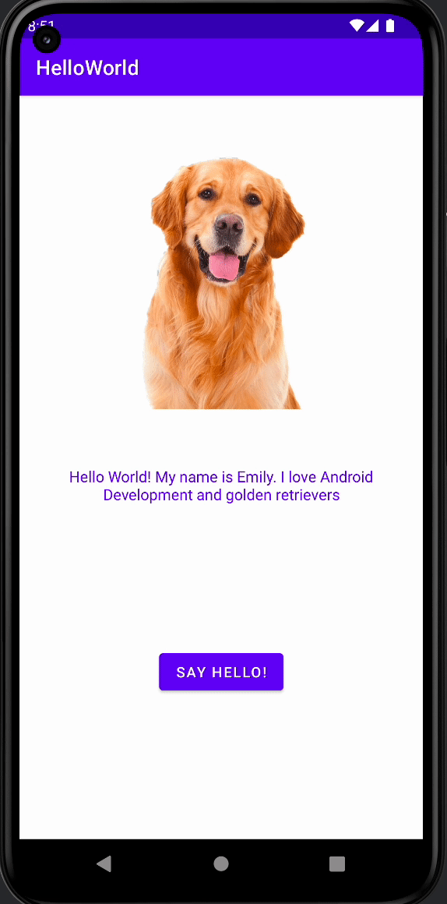

# Android Prework - *Emily*

Submitted by: **Trinh Nguyen**

**Emily** is an android app that shows an image and introductory message, and allows pressing a button to display a Toast. 

Time spent: **2.5** hours spent in total

## Required Features

The following **required** functionality is completed:

* [x] Image and introductory message displayed on screen
* [x] Button displayed on screen
* [x] Toast with message appears when button is pressed 

The following **optional** features are implemented:

* [x] The texts are being centered and the font size is changed from default setting to make it more user friendly

## Video Walkthrough

Here's a walkthrough of implemented features:

GIF created with [LiceCap](http://www.cockos.com/licecap/).  

## Notes

It took me quite a bit to familiarize myself with Github. Additionally, Kotlin syntax wasn't easy to remember without practicing a lot as I mainly use Python. 

## License

    Copyright [2022] [Trinh Nguyen]

    Licensed under the Apache License, Version 2.0 (the "License");
    you may not use this file except in compliance with the License.
    You may obtain a copy of the License at

        http://www.apache.org/licenses/LICENSE-2.0

    Unless required by applicable law or agreed to in writing, software
    distributed under the License is distributed on an "AS IS" BASIS,
    WITHOUT WARRANTIES OR CONDITIONS OF ANY KIND, either express or implied.
    See the License for the specific language governing permissions and
    limitations under the License.
